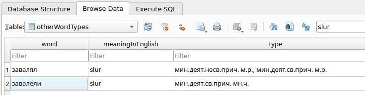

# About the project

This tool will help you learn Bulgarian more efficiently saving you time and effort. It only generates flashcards for the irregular forms of the words.

## Goals and Motivation

TODO To complete this section

## Advantages

You can study your own vocabulary with your own English translations using [Ankiweb](https://ankiweb.net/). You can focus on only learning the irregular forms of the nouns, adjectives, adverbs and verbs.

## Features

* Generates flashcards for your own vocabulary. You can choose what words are important for you
* It generates additional flashcards for the irregular forms of the word
* Searches for the translation in English on [DeepL](https://www.deepl.com/translator) and [PONS's online dictionary](https://en.pons.com/translate/bulgarian-english/) and you can modify and extend those translations
* Stores the flashcards in a database which you can modify manually using the [SQLite Database Browser](https://sqlitebrowser.org/)

## Limitations

* Only irregular forms which are in the [grammar dictionary](https://rechnik.chitanka.info/w) are identified
* You have to enter your own vocabulary. If you want to spare time by creating the deck, you can use [Ankiweb's decks with Bulgarian vocabulary](https://ankiweb.net/shared/decks?search=bulgarian)

# Getting stated

TODO To complete this section

## Installation

Please run the script installDictionary.py to create a local copy of the grammatical classification of the words

TODO Automatize this step

## Configuration

TODO To complete this section

# Help

## FAQ

* Is is possible to use other translation services or online dictionaries?

Yes, please create a feature request explaining what are the advantages over DeepL and PONS. If I have time, I will do the connection

* What is imported if a verb has a particple with multiple derivative forms like 'завалял'?

When having something like:
```
{'мин.деят.св.прич. м.р.': 'завалял', 
    'мин.деят.св.прич. мн.ч.': 'завалели', 
    'мин.деят.несв.прич. м.р.': 'завалял'}
```
The duplicated participles are combined and imported like this:


## Troubleshooting

TODO To complete this section

## How to report a bug

TODO To complete this section

# Get involved

TODO To complete this section

# How to contribute

TODO To complete this section


